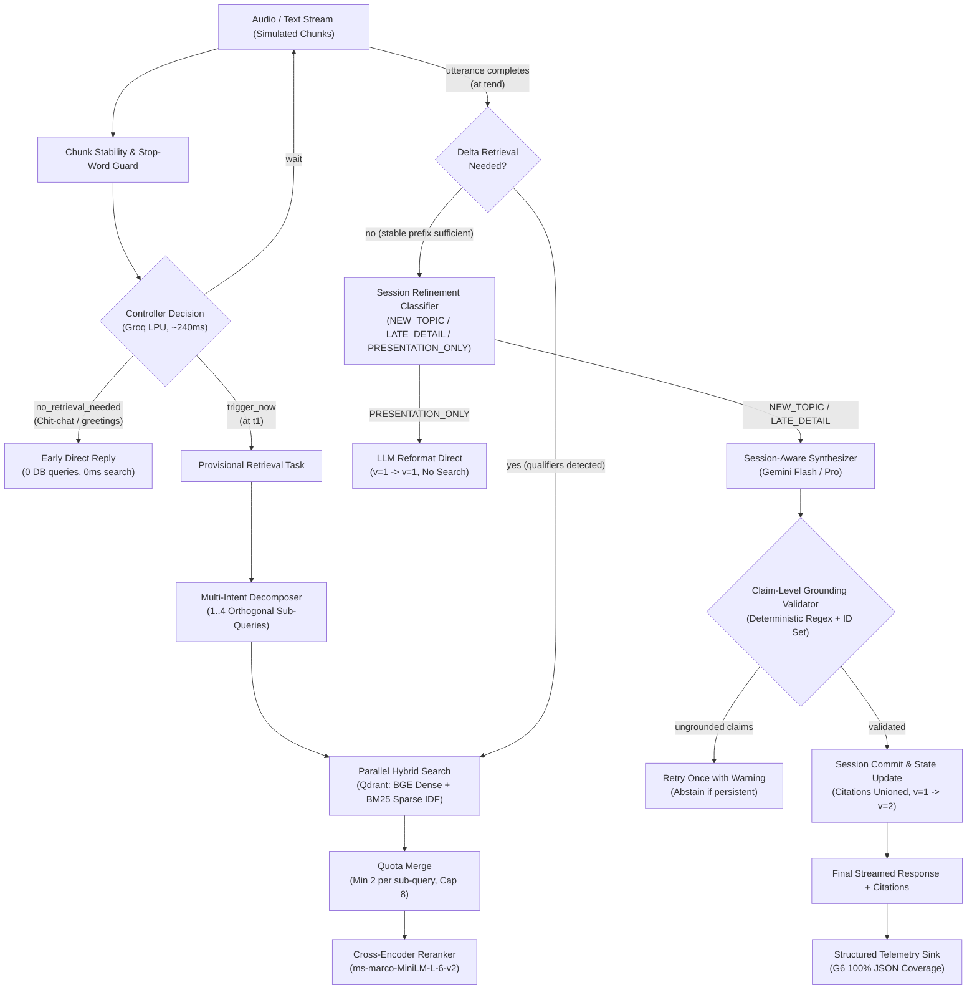

# System Architecture Brief

This document outlines the end-to-end architecture for the Streaming Live RAG system (Samsung PRISM GenAI Hackathon 2026-27, Theme 4).

---

## 1. Component Flow & Pipeline



---

## 2. Component Boundaries & Interfaces

| Component | Responsible for | Interface | Audit Reference |
| :--- | :--- | :--- | :--- |
| **Stream Simulator** | Replaying full utterance as timestamped incremental chunks. | `simulate_stream(utterance, chunk_size, delay_ms)` | `streaming/stream_simulator.py` |
| **Heuristics & Guard** | Token count, question word detection, stop-word trailing guard. | `is_stable_enough(text) -> bool` | Finding H4 (`controller/heuristics.py`) |
| **Two-Stage Controller** | Fast decision: `trigger_now`, `wait`, `no_retrieval_needed`. Early return for chit-chat. | `decide_retrieval(text) -> ControllerDecision` | Findings C2, C3 (`controller/decide.py`) |
| **Multi-Intent Decomposer** | Splitting compound requests into 1..4 orthogonal sub-queries. | `decompose_query(utterance) -> list[str]` | Finding H7 (`controller/decompose.py`) |
| **Hybrid Search (Qdrant)** | Parallel dense BGE-Small and sparse BM25 (`Modifier.IDF`) queries. | `retrieve_and_rerank(query, top_k) -> list[dict]` | Finding H6 (`retrieval/hybrid_search.py`) |
| **Quota Result Merger** | Deduplicating candidates while allocating min 2 chunks per sub-query, cap 8 chunks total. | `merge_with_quota(sub_results, min_per_query=2, cap=8)` | Finding H8 (`retrieval/merge.py`) |
| **Cross-Encoder Reranker** | Rescoring candidate chunks using `ms-marco-MiniLM-L-6-v2`. | Embedded in `retrieve_and_rerank()` | `retrieval/hybrid_search.py` |
| **Session Refinement Classifier** | Classifying turns into `NEW_TOPIC`, `LATE_DETAIL`, or `PRESENTATION_ONLY`. | `classify_refinement(history, utterance) -> str` | Findings C4, C7 (`controller/refinement.py`) |
| **Session Store** | In-memory session tracking, version progression ($1 \to 1 \to 2 \to 1$), citation unioning. | `Session.update()`, `get_or_create_session()` | Finding C7 (`session/store.py`) |
| **Session-Aware Synthesizer** | Grounded response generation with explicit section citations. | `call_gemini_synthesis(context, utterance, history)` | `api/main.py` |
| **Claim-Level Grounding Validator** | 44-line deterministic validator checking bracket variants, valid IDs, and uncertainty. | `validate(answer, context_chunk_ids) -> GroundingReport` | Findings C5, C6 (`retrieval/grounding.py`) |
| **Telemetry Sink** | Emits complete structured JSON telemetry event per turn. | `emit(event: TelemetryEvent)` | Finding G6 (`telemetry/sink.py`) |

---

## 3. Core Data & Telemetry Schema

The pipeline emits a strict, self-contained telemetry event for every turn:

```json
{
  "session_id": "sess_8f2a",
  "turn_id": 3,
  "refinement_type": "LATE_DETAIL",
  "controller_decisions": [
    {"trigger": "trigger_now", "timestamp_s": 0.84, "reason": "Stable query with capacity criteria detected"}
  ],
  "retrieval_events": [
    {"timestamp_s": 0.85, "query": "Pune workshop venue capacity 30", "trigger": "provisional"},
    {"timestamp_s": 1.42, "query": "cancellation policy workshop venues Pune", "trigger": "delta"}
  ],
  "sub_queries": [
    "venue capacity for 30 attendees in Pune",
    "cancellation terms and refund policies"
  ],
  "answer": "The Pune venue accommodates up to 45 attendees in Classroom setup [Doc_01 §1]. Cancellations made 7+ days prior receive a full deposit refund [Doc_02 §3].",
  "citations": ["Doc_01 §1", "Doc_02 §3"],
  "uncertainty": null,
  "grounding_score": 1.0,
  "grounding_report": {
    "is_grounded": true,
    "cited_ids": ["Doc_01 §1", "Doc_02 §3"],
    "fabricated_ids": [],
    "expresses_uncertainty": false
  },
  "answer_version": 2,
  "latencies_ms": {
    "controller": 248,
    "decompose": 284,
    "retrieval": 78,
    "rerank": 42,
    "synthesis": 810,
    "grounding": 1,
    "end_to_end": 1463
  },
  "token_cost": {
    "fast_llm_tokens": 312,
    "synthesis_input_tokens": 584,
    "synthesis_output_tokens": 128,
    "usd_estimate": 0.00062
  }
}
```

---

## 4. Final Technology Stack

| Layer | Component | Implementation | Key Justification |
| :--- | :--- | :--- | :--- |
| **API Framework** | FastAPI + Uvicorn | Python 3.11+, async native | Async `asyncio.to_thread` for non-blocking I/O (H1). |
| **Fast LLM (Controller)** | Groq LPU API | `openai/gpt-oss-20b` / `groq/compound-mini` | Sub-400ms decision latency for streaming chunks (ADR-4). |
| **Synthesis LLM** | Gemini API | `gemini-3.8-flash` / `gemini-2.5-flash` | Superior synthesis quality, citation reasoning, and cost. |
| **Vector & Sparse DB** | Qdrant | Docker `qdrant/qdrant:v1.13.2` | Native RRF fusion, named dense+sparse vectors in single node. |
| **Dense Embeddings** | FastEmbed | `BAAI/bge-small-en-v1.5` | High retrieval accuracy, local ONNX runtime, zero API cost. |
| **Sparse Embeddings** | FastEmbed | `Qdrant/bm25` (`Modifier.IDF`) | Deterministic lexical matching for numbers and policy codes. |
| **Cross-Encoder Reranker**| FastEmbed | `Xenova/ms-marco-MiniLM-L-6-v2` | High precision reranking without GPU requirements. |
| **Grounding Verification**| In-house | 44-line deterministic validator | Zero LLM cost, catches fabricated IDs and bracket variants. |
| **Evaluation Suite** | In-house Gates G1–G6 | `eval/run_eval.py` + `labeled_set.yaml` | Unattended automated pass/fail verification for hackathon. |

