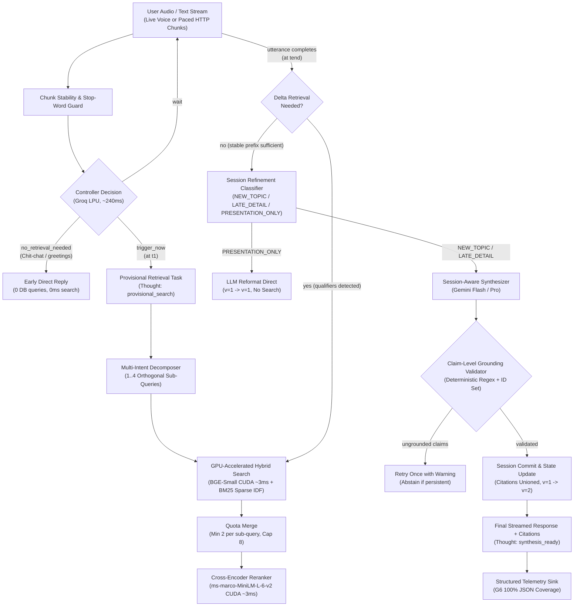
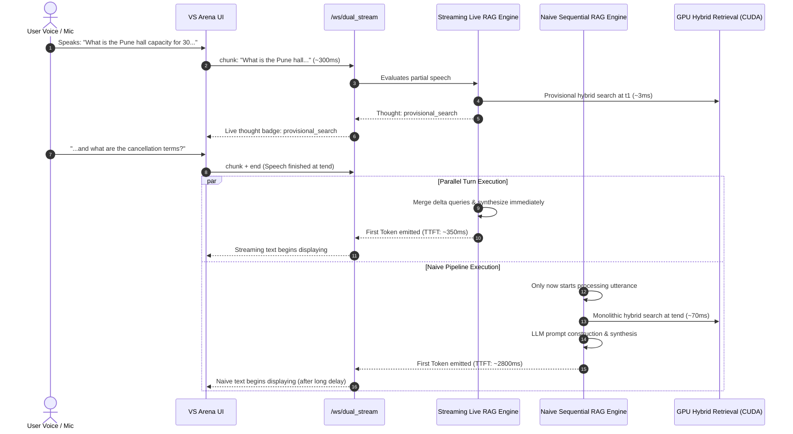

# System Architecture Brief

This document outlines the end-to-end architecture for the Streaming Live RAG system (Samsung PRISM GenAI Hackathon 2026-27, Theme 4), including the real-time speech controller, side-by-side VS Arena, live voice streaming, hardware GPU acceleration, and deterministic grounding.

---

## 1. Component Flow & Pipeline



---

## 2. Live Side-by-Side VS Arena Architecture (`/ws/dual_stream`)

To demonstrate the empirical superiority of **Streaming Live RAG** over **Naive Sequential RAG**, the system features a dedicated real-time concurrent arena over WebSockets:



### Architectural Guarantees of the VS Arena:
1. **Isolated Session Contexts**: `sess_left` (Streaming) and `sess_right` (Naive) run with distinct session memory to avoid cross-contamination.
2. **Cache-Bypassing (`ignore_cache=True`)**: Bypasses vector caching to ensure neither pipeline receives an unfair advantage from warm search results.
3. **Identical Hardware & Models**: Both pipelines execute on the identical GPU execution providers and LLM configurations.

---

## 3. Hardware GPU Acceleration Architecture

The retrieval layer dynamically binds hardware acceleration across dense vector generation and cross-encoder reranking:

```
[FastEmbed / ONNX Runtime]
           │
           ├── 1. Windows Dynamic Linker: os.add_dll_directory(torch_lib_path)
           │      └── Resolves: cublas64_12.dll, cudart64_12.dll, cudnn64_9.dll
           │
           ├── 2. Provider Resolution:
           │      ├── If CUDA available: ['CUDAExecutionProvider', 'CPUExecutionProvider']
           │      ├── Else if DirectML available: ['DmlExecutionProvider', 'CPUExecutionProvider']
           │      └── Fallback: ['CPUExecutionProvider']
           │
           └── 3. Accelerated Models:
                  ├── TextEmbedding: BAAI/bge-small-en-v1.5 (~3.0ms per query)
                  └── TextCrossEncoder: ms-marco-MiniLM-L-6-v2 (~3.0ms per rerank)
```

- **Diagnostics Endpoint**: `GET /system/hardware` inspects active providers, CUDA device name, total VRAM, and driver status.
- **Latency Gains**: Dense embedding inference dropped from ~50ms to **3.0ms**; Cross-Encoder reranking dropped from ~120ms to **3.0ms**.

---

## 4. Multi-Format Corpus Ingestion, Isolation & Deduplication

The corpus ingestion engine (`retrieval/ingest.py`) parses diverse document formats while ensuring idempotent, duplicate-free vector indexing and benchmark reproducibility:

```
data/
  ├── dev_corpus/                    --> Clean default benchmark corpus
  │     ├── venue_booking.txt        --> Doc_01 (4 benchmark chunks total)
  │     └── travel_policy.txt        --> Doc_02
  ├── sample_documents/              --> Sample reference PDFs (OS, concurrency, resumes)
  │     ├── Doc_03_Module_5_memory_management.pdf
  │     ├── Doc_03_Segmentation.pdf
  │     ├── Doc_03_Yuvraj_s_Resume.pdf
  │     └── Doc_04_Module_4_Concurrency.pdf
  └── uploads/                       --> Isolated namespace for dynamic user uploads
```

1. **Format Parsers**: Supports `.txt`, `.md`, and `.pdf` (via `pypdf` extraction) with clean section/header chunking.
2. **Benchmark Corpus Isolation**: On startup, the application auto-seeds strictly `Doc_01` and `Doc_02` (4 chunks) into `dev_corpus_dense` to ensure 100% reproducible benchmark scores.
3. **Dynamic User Uploads**: Dynamic uploads via `POST /corpus/upload` are persisted to `data/uploads/`, assigned canonical `Doc_XX` identifiers, and indexed incrementally without mutating the pristine benchmark corpus.
4. **SHA-256 Deduplication**: Generates content hashes for all files. If identical content is submitted under different filenames, duplicate embedding is skipped.
5. **Stable Identifier Mapping**: Guarantees deterministic mapping to canonical `Doc_XX §Section` identifiers for deterministic grounding validation.

---

## 5. Cognitive Thought Stream & Continuous Speculative Retrieval

To provide explainability, transparency, and sub-second user feedback without artificial delays or pre-canned logs, the core engine (`streaming/engine.py`) emits honest structured thought events reflecting genuine pipeline state:

| Phase | Event Type | Description | Timing & Trigger |
| :--- | :--- | :--- | :--- |
| **Phase 0** | `cache_hit` | Fast-path response for repeated queries. Emits instant thought narration and returns verified grounded response with zero retrieval latency. | Instant ($t = 0\text{ms}$) |
| **Phase 1** | `provisional_search` | Launched as soon as the controller detects a stable prefix. Hybrid retrieval runs speculatively in the background while the speaker is still talking ($t_1 < t_{end}$). | Early trigger ($t_1$) |
| **Continuous Speculation** | `provisional_search (multi-clause)` | Continuous multi-intent speculative parsing (`split_intent_clauses`, `extract_topic`). Evaluates additional distinct clauses during speech and fires up to 4 parallel speculative searches concurrently. | Active speech ($t_1 < t_i < t_{end}$) |
| **Phase 2** | `utterance_end` | Speech finishes. Ingests continuation words, folds in new clauses, and checks collective token/stem coverage (70% threshold) against in-flight speculative searches. | Utterance completion ($t_{end}$) |
| **Phase 3** | `decomposition_planned` | Dispatches delta hybrid search fan-out only for uncovered intents, awaits all in-flight speculative tasks, and performs quota merge (min 2 chunks per sub-query, cap 8 chunks total). | Post-speech delta phase |
| **Phase 4** | `synthesis_ready` | Synthesizes the response, validates claim-level citations against indexed chunks, computes grounding confidence, and updates session version. | Pre-emission ($t_{synth}$) |

Both the live WebSocket endpoints (`/ws/stream`, `/ws/compare`, `/ws/dual_stream`) and the HTTP turn endpoint (`/turn`) emit this thought stream.

---

## 6. Component Boundaries & Interfaces

| Component | Responsible for | Interface | Audit Reference |
| :--- | :--- | :--- | :--- |
| **Unified Turn Engine** | Single source of truth for executing live streaming turns, continuous speculative search, and emitting thoughts. | `run_live_turn(session_id, source, emit_event)` | `streaming/engine.py` |
| **Dual-Stream Controller** | Runs Streaming RAG vs Naive Sequential RAG concurrently with independent sessions and cache bypassing. | `WebSocket /ws/compare`, `/ws/dual_stream`, `POST /turn/compare` | `api/main.py` |
| **Live Stream Source** | Real-time queue for WebSockets and paced playback for HTTP replays. | `LiveQueueSource`, `play_utterance(text, words, ms)` | `streaming/live_stream.py` |
| **Heuristics & Guard** | Token count, question word detection, trailing stop-word guard. | `is_stable_enough(text) -> bool` | Finding H4 (`controller/heuristics.py`) |
| **Two-Stage Controller** | Fast decision: `trigger_now`, `wait`, `no_retrieval_needed`. Early return for chit-chat. | `decide_retrieval(text) -> ControllerDecision` | Findings C2, C3 (`controller/decide.py`) |
| **Multi-Intent Decomposer** | Splitting compound requests into 1..4 orthogonal sub-queries. | `decompose_query(utterance) -> list[str]` | Finding H7 (`controller/decompose.py`) |
| **Hybrid Search (Qdrant)** | Parallel dense BGE-Small and sparse BM25 (`Modifier.IDF`) queries with GPU acceleration and embedded auto-fallback. | `retrieve_and_rerank(query, top_k) -> list[dict]` | Finding H6 (`retrieval/hybrid_search.py`) |
| **Quota Result Merger** | Deduplicating candidates while allocating min 2 chunks per sub-query, cap 8 chunks total. | `merge_with_quota(sub_results, min_per_query=2, cap=8)` | Finding H8 (`retrieval/merge.py`) |
| **Cross-Encoder Reranker** | Rescoring candidate chunks using `ms-marco-MiniLM-L-6-v2` with CUDA acceleration (~3ms). | Embedded in `retrieve_and_rerank()` | `retrieval/hybrid_search.py` |
| **Query Response Cache** | Thread-safe in-memory cache for exact/normalized repeated queries with instant Phase 0 thought emission. | `get_cached_response()`, `set_cached_response()`, `clear_query_cache()` | `streaming/engine.py` |
| **Hardware Diagnostics** | Real-time detection of CUDA, DirectML, and active ONNX providers. | `get_gpu_info()`, `GET /system/hardware` | `retrieval/hybrid_search.py`, `api/main.py` |
| **Session Refinement Classifier** | Classifying turns into `NEW_TOPIC`, `LATE_DETAIL`, or `PRESENTATION_ONLY`. | `classify_refinement(history, utterance) -> str` | Findings C4, C7 (`controller/refinement.py`) |
| **Session Store** | In-memory session tracking, version progression ($1 \to 1 \to 2 \to 1$), citation unioning, and cache bypass. | `Session.update()`, `get_or_create_session()` | Finding C7 (`session/store.py`) |
| **Claim-Level Grounding Validator** | 44-line deterministic validator checking bracket variants, valid IDs, and uncertainty. | `validate(answer, context_chunk_ids) -> GroundingReport` | Findings C5, C6 (`retrieval/grounding.py`) |
| **Telemetry Sink** | Emits complete structured JSON telemetry event per turn. | `emit(event: TelemetryEvent)` | Finding G6 (`telemetry/sink.py`) |

---

## 7. Technology Stack & Design Decisions

| Layer | Component | Implementation | Key Justification |
| :--- | :--- | :--- | :--- |
| **API Framework** | FastAPI + Uvicorn | Python 3.10+, async native | Real-time WebSockets, streaming endpoints, and non-blocking I/O. |
| **Hardware Acceleration** | ONNX Runtime GPU (CUDA 12) | PyTorch DLL Linker + CUDAExecutionProvider | 3.0ms embedding & reranking inference on NVIDIA RTX 5060 Laptop GPU. |
| **Fast LLM (Controller)** | Groq LPU API | `openai/gpt-oss-20b` / `llama-3.1-8b-instant` | Sub-400ms decision latency for chunk-by-chunk stream evaluation (ADR-4). |
| **Synthesis LLM** | Gemini API | `gemini-3.5-flash-lite` / `gemini-2.5-flash` | Superior synthesis quality, citation reasoning, and hallucination resistance. |
| **Vector & Sparse DB** | Qdrant | Docker `qdrant:v1.13.2` with embedded fallback | Native RRF fusion, named dense+sparse vectors in single node, zero external dependency fallback. |
| **Dense Embeddings** | FastEmbed | `BAAI/bge-small-en-v1.5` | High retrieval accuracy, local ONNX runtime, GPU accelerated. |
| **Sparse Embeddings** | FastEmbed | `Qdrant/bm25` (`Modifier.IDF`) | Deterministic lexical matching for numbers and policy codes. |
| **Cross-Encoder Reranker**| FastEmbed | `Xenova/ms-marco-MiniLM-L-6-v2` | High precision reranking with GPU acceleration. |
| **Grounding Verification**| In-house | 44-line deterministic validator | Zero LLM cost, catches fabricated IDs and bracket variants. |
| **Live Speech Transport** | Web Speech API | Client-side streaming over WebSockets | Native zero-dependency browser voice streaming with live audio waves. |
